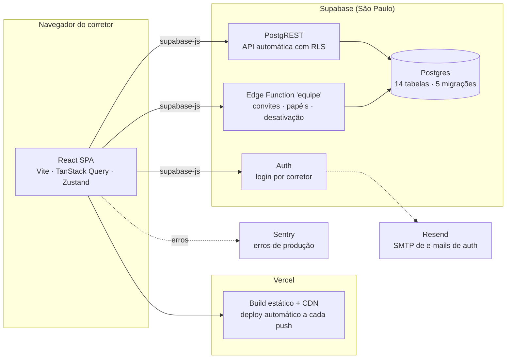
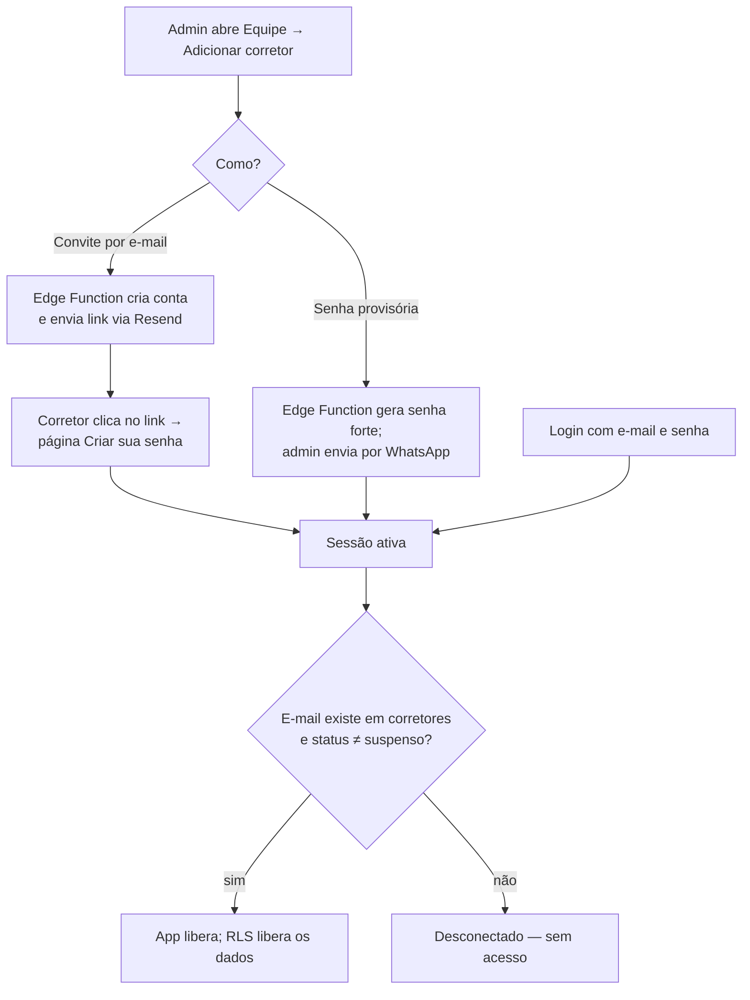
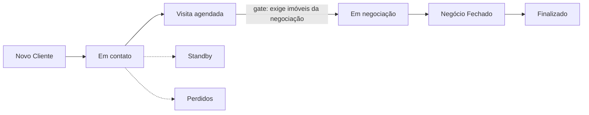

# NAVIS COM VOCÊ — CRM imobiliário

CRM por workflow para corretores de imóveis (produto by Navis). Kanban de imóveis e clientes,
motor de matching com score ponderado, gestão de equipe com papéis, autenticação e banco de
dados reais.

**Produção:** https://navis-crm.vercel.app

## Arquitetura

O frontend fala diretamente com o Supabase via SDK — não há servidor de aplicação próprio
para manter no ar.



Decisões de arquitetura registradas em [MIGRACAO.md](MIGRACAO.md) (histórico da migração
mockup → produção). Destaques:

- **Fotos por link, sem storage**: o corretor cola a URL da foto do anúncio; o banco tem
  trava (`fotos_somente_url`) que rejeita imagens embutidas. Custo de storage: zero.
- **Segurança no banco, não só na tela**: RLS restringe todo acesso a e-mails cadastrados
  na tabela `corretores`; escrita em `corretores` e exclusões são exclusivas de admin;
  corretor suspenso é banido do login e perde acesso aos dados.
- **Modo mock preservado**: sem `.env.local`, o app roda 100% offline (MSW + localStorage) —
  útil para desenvolvimento e testes.

## Fluxos principais

### Autenticação e entrada na equipe



### Pipeline de imóveis (Kanban)


### Pipeline de clientes (Kanban)



As transições têm **gates** (validações por etapa em `src/domain/gatesImovel.ts` e
`gatesLead.ts`). O **matching** (`src/domain/matching.ts`) cruza o perfil de busca de cada
cliente com os imóveis e calcula um score 0–100 com pesos configuráveis por corretor.

## Rodando local

```bash
npm install
npm run dev
```

- **Sem `.env.local`** → modo mock: dados fictícios no navegador, sem login (útil pra
  desenvolver offline).
- **Com `.env.local`** → banco real + login obrigatório:

```
VITE_SUPABASE_URL=https://<projeto>.supabase.co
VITE_SUPABASE_ANON_KEY=<anon key>
VITE_SENTRY_DSN=<dsn>            # opcional
```

## Scripts e operações

| Comando | O quê |
|---|---|
| `npm run dev` | servidor de desenvolvimento |
| `npm run build` | typecheck + build de produção |
| `npm test` | testes (vitest) |
| `npm run lint` | eslint |
| `npx vite-node scripts/seed.ts` | carga dos dados de demonstração no banco (idempotente) |
| `npx supabase db push` | aplica migrações pendentes no banco remoto |
| `npx supabase functions deploy equipe` | publica a Edge Function de gestão de equipe |
| `npx supabase migration list` | confere paridade migrações local × remoto |

## Deploy

Automático: **push na `main` → Vercel builda e publica**. Variáveis de ambiente ficam em
Vercel → Settings → Environments → Production. Migrações de banco são aplicadas manualmente
via `npx supabase db push` (exige CLI logado e senha do banco).

## Estrutura

```
src/
  app/            rotas, layout, guardas (RequireAuth/RequireAdmin)
  components/     UI por domínio (imovel, lead, kanban, match, equipe…)
  domain/         tipos, etapas, gates e motor de matching (puro, testado)
  hooks/          TanStack Query — fala com Supabase (ou MSW no modo mock)
  lib/            supabase, mapeadores snake↔camel, sentry, formatação
  mocks/          modo demonstração (MSW + localStorage) e dados de seed
  pages/          telas
  stores/         zustand (auth, notificações, score, ui)
supabase/
  migrations/     schema versionado (fonte da verdade do banco)
  functions/      Edge Function 'equipe' (service role; só ela cria/gerencia contas)
scripts/seed.ts   dados de demonstração
```

## Gestão da equipe (tela Equipe, só admin)

Convidar corretor (e-mail ou senha provisória) · promover/rebaixar admin · desativar/reativar
· redefinir senha · excluir convite não usado. Travas: ninguém desativa a si mesmo nem remove
o próprio papel de admin (o sistema nunca fica sem administrador).

> E-mails de convite/redefinição usam Resend. Sem domínio verificado, entregam apenas para o
> e-mail do dono da conta Resend — para a equipe real, verificar um domínio próprio no Resend.
